

  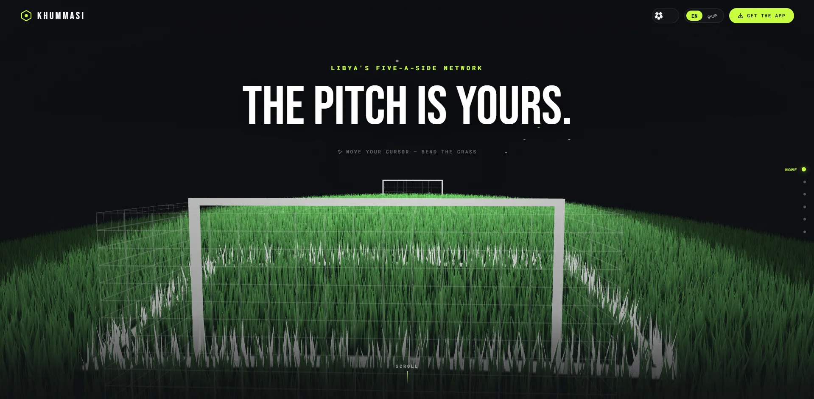

  # Khummasi (خماسي) — Sports Booking Platform
  
  **Solo Full-Stack Architect & Engineer** | **6+ Months** | **Production-Ready**
  
  
  
  
  

  ### **[→ View the live portfolio](https://manna-portfolio.web.app)**

  *Note: Khummasi is a proprietary commercial project. This repository is an architectural case study and showcase — the source code is private.*

---

## Contents

1. [Video Walkthrough](#-video-walkthrough)
2. [Scale & Metrics](#-scale--metrics)
3. [Architecture & Data Flow](#️-architecture--data-flow)
4. [Complete Tech Stack](#️-complete-tech-stack)
5. [Engineering Deep Dives](#-engineering-deep-dives)
6. [The Command Center (Admin Dashboard)](#️-the-command-center-admin-dashboard)
7. [Screens](#the-player-experience-mobile)
8. [Get In Touch](#-get-in-touch)

---

## 🎬 Video Walkthrough

> **[▶️ Watch the 5-Minute Technical Walkthrough on YouTube / Loom](link-to-your-video)**

*(Watch the video to see the full Player, Owner, and Admin experiences, including live RTL flipping and realtime push notifications.)*

---

## 📊 Scale & Metrics

I built this entire 4-platform ecosystem from zero to production as the sole developer.

| Metric | Value |
|---|---|
| **Mobile Screens** | 53 (Player, Owner, Auth, Detail views) |
| **Admin Dashboard** | 19 routes / 23 screens, 3-tier RBAC, TOTP MFA |
| **Custom UI Components** | ~100 (Custom Neo-Surface design system) |
| **Backend Endpoints** | 157 distinct REST endpoints |
| **Cloud Functions** | 5 (Firestore triggers + automated sweeps) |
| **Security Rules** | 21KB (498 lines) of custom RBAC Firestore rules |
| **Database Indexes** | 29 composite Firestore indexes |
| **Languages** | Native bilingual support (English + Arabic RTL) |
| **User Roles** | 4 (Player, Owner, Staff, Admin) |

---

## 🏗️ Architecture & Data Flow

Khummasi utilizes a **Dual-Path Data Model**. To ensure ultra-low latency without sacrificing security:
1. **Realtime Reads** (e.g., chat, notifications, feeds) connect directly to Firestore via client `onSnapshot` listeners.
2. **Financial/Social Mutations** (e.g., booking slots, updating wallets) are strictly denied by Firestore rules and must route through the Express backend, which validates logic and executes transactions via the Firebase Admin SDK.

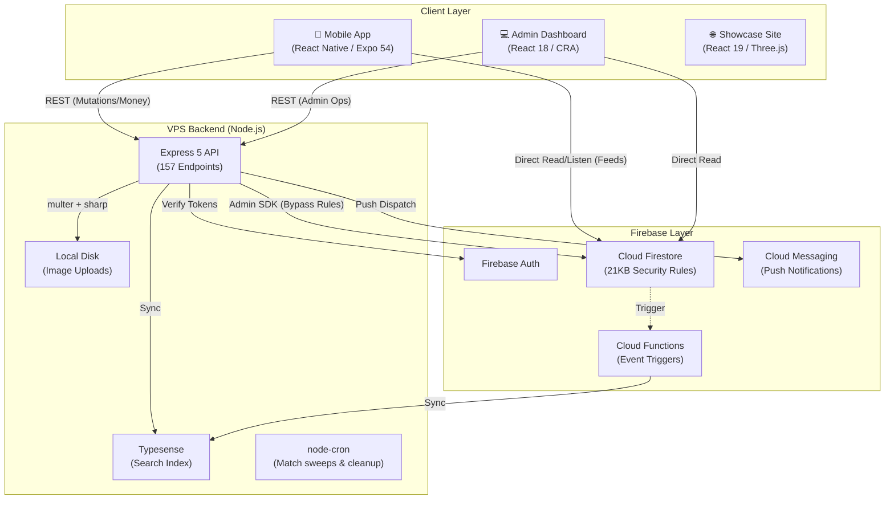

---

## 🛠️ Complete Tech Stack

| Layer | Technology |
|---|---|
| **Mobile** | Expo SDK 54, React Native 0.81.5, React 19.1, expo-router 6, react-query 5, Skia, Reanimated 4, Leaflet (via WebView) + Native Maps |
| **Admin Dashboard** | React 18, React Router 6, Recharts, Leaflet + react-leaflet, i18next (EN/AR), otplib TOTP MFA, Firebase Web SDK, axios |
| **Backend API** | Node.js, Express 5.1, Firebase Admin SDK, zod, Winston, multer + sharp (self-hosted images), helmet, express-rate-limit |
| **Database & Auth** | Firebase Auth, Cloud Firestore, Cloud Functions |
| **Search** | Typesense (full-text search engine synced via backend/triggers) |
| **Infrastructure** | Bare-metal VPS (Ubuntu), Nginx (Reverse Proxy), PM2, Firebase Hosting |

---

## 🧠 Engineering Deep Dives

Building a multi-sided marketplace solo requires aggressive scope management and robust system design. Read my deep dives into the hardest engineering challenges I solved:

👉 **[Read the Technical Challenges (CHALLENGES.md)](./CHALLENGES.md)**

*Highlights include:*
- **The Integrity Court:** Building adversarial test harnesses to storm my own booking endpoints.
- **RBAC without a Microservice:** Delegating access using 498 lines of Firestore Security Rules.
- **Leaflet-in-WebView:** Bypassing native map limitations for a highly customized explore map.
- **The RTL Double-Flip:** Solving complex internationalization layout bugs.

---

### The Player Experience (Mobile)

  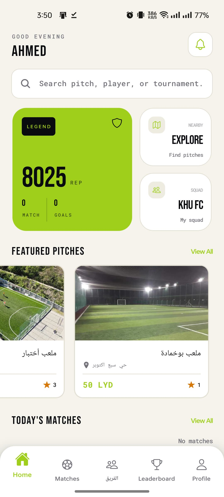
  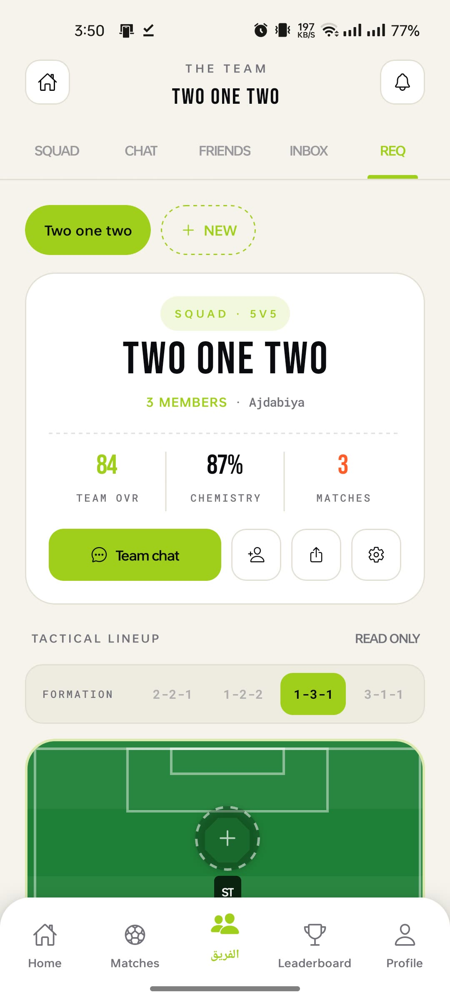
  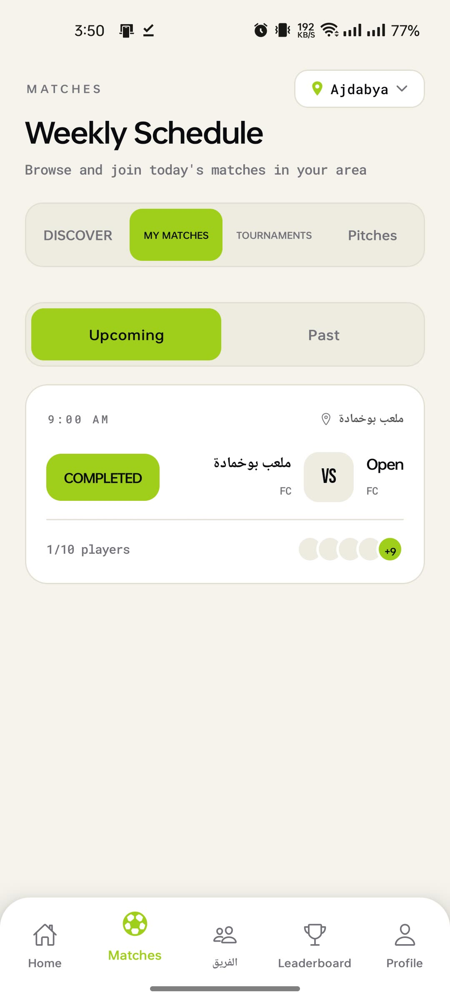

 

  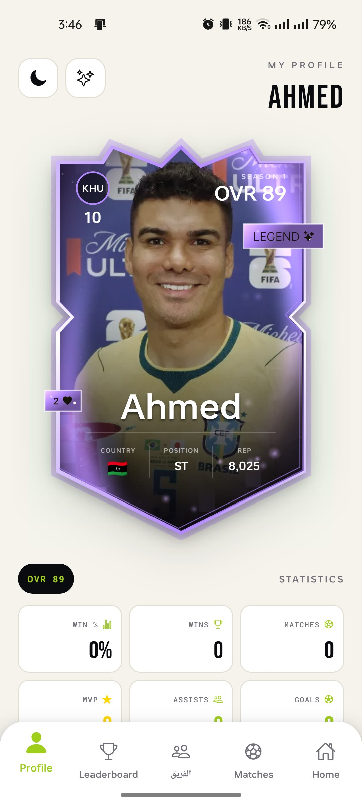
  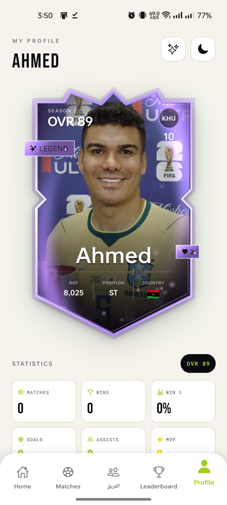
  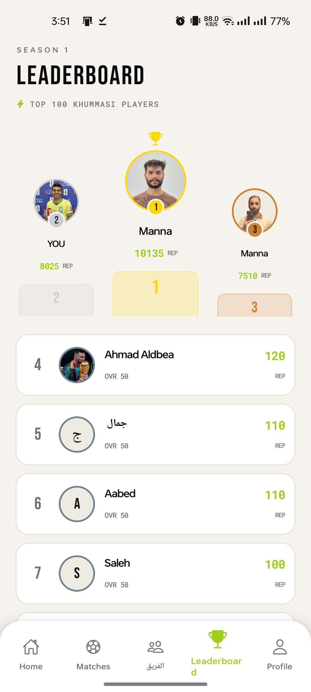

### The Owner Experience (Mobile)

  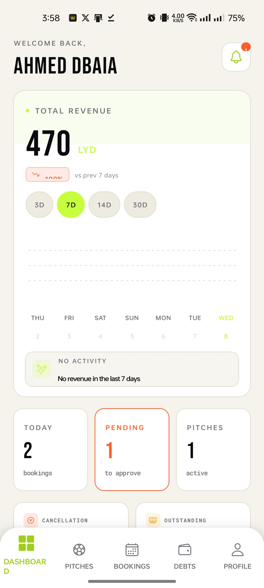
  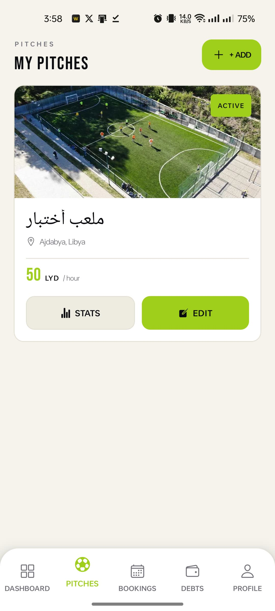
  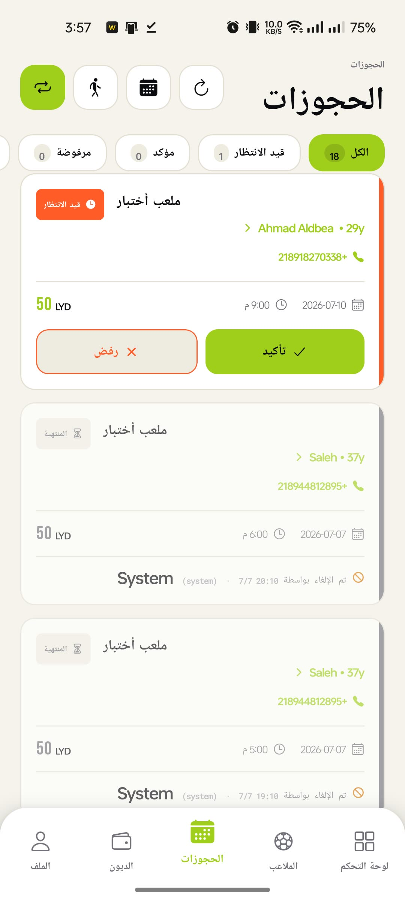

 

  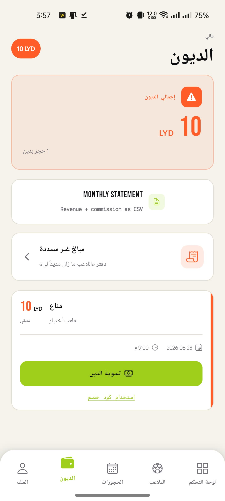
  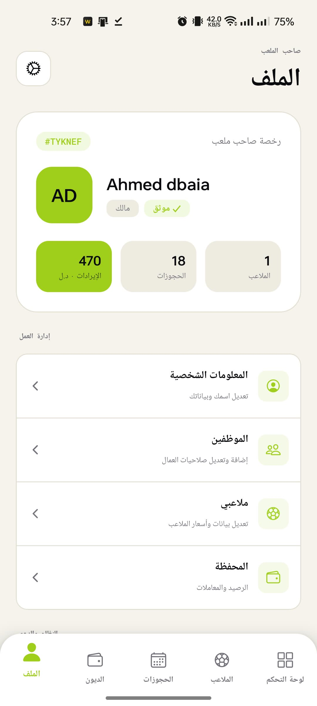

---

## 🛡️ The Command Center (Admin Dashboard)

The dashboard is the largest single surface in the platform — **19 routes across
23 screens**, and the control plane for everything the mobile apps can't do
themselves. It is not a CRUD table over Firestore; it is a moderation, finance,
and operations console with its own permission model.

  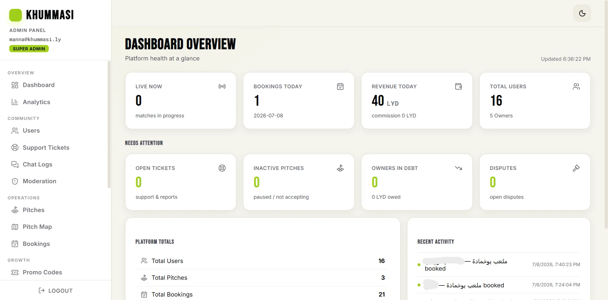

### Tiered RBAC via custom claims

Rather than a boolean `isAdmin`, access is graded into three levels stamped as
**Firebase custom claims** and enforced on both ends:

| Level | Value | Typical access |
| --- | --- | --- |
| `support` | 1 | Read-only triage — tickets, chat logs, user lookup |
| `standard` | 2 | Day-to-day moderation, bookings, pitches, disputes |
| `super` | 3 | Finances, admin management, audit log, destructive actions |

A shared `ADMIN_LEVELS` map (`{ support: 1, standard: 2, super: 3 }`) lets both
the React guard and the Express middleware answer the same question — *is this
token's level at least the minimum this action requires?* — from one definition,
so the UI can never offer an action the API would reject.

### Mandatory TOTP multi-factor

Admin auth is gated behind a second factor before any privileged route renders.
Enrolment issues a QR code (`qrcode`) consumed by any authenticator app;
verification runs server-side through `otplib`, and only on success does the
backend **stamp an MFA claim onto the token**. Because the claim lives in the
token rather than in client state, refreshing the page or reopening the tab
cannot bypass the gate.

### What it actually operates

| Area | Screens |
| --- | --- |
| **Oversight** | Dashboard, Analytics (Recharts), Audit Log |
| **People** | Users, User Detail, Admin Management, Moderation, Support, Chat Log |
| **Supply** | Pitches, Pitch Map (Leaflet), Bookings, Disputes |
| **Money & growth** | Financial, Monetization, Promo Codes, Seasons, Announcements |

Two of these are worth calling out. **Pitch Map** renders every venue on an
interactive Leaflet map for geographic oversight rather than a list. And the
**Audit Log** is append-only: every privileged mutation writes an immutable
`auditLogs` entry server-side, so administrative action is reconstructable after
the fact — which matters when real money and bans are involved.

The dashboard is also **fully bilingual** (English / Arabic RTL) via i18next,
sharing the same `@khummasi/shared-types` package as the backend so permission
levels and domain models cannot drift between the two.

  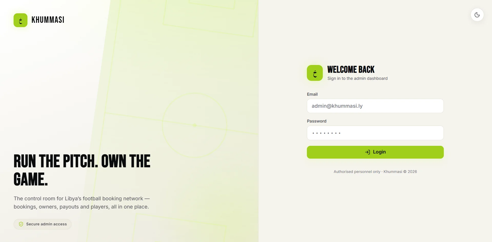

### The Showcase Landing Page

  

---

## 📬 Get In Touch

I'm a full-stack engineer and visual director based in Libya, currently open to
new opportunities. The interactive version of this case study — along with my
cinematography and graphic design work — lives on my portfolio:

### **[→ manna-portfolio.web.app](https://manna-portfolio.web.app)**

| | |
| --- | --- |
| **Email** | [manna.faraj.dev@gmail.com](mailto:manna.faraj.dev@gmail.com) |
| **Phone** | +218 910628025 |
| **GitHub** | [@manna1lix](https://github.com/manna1lix) |
| **LinkedIn** | [Manna Faraj Manna](https://www.linkedin.com/in/manna-faraj-783b85195) |
| **Portfolio** | [manna-portfolio.web.app](https://manna-portfolio.web.app) |

---

**Manna Faraj Manna** — Full-Stack Engineer &amp; Visual Director

*Khummasi was designed, built, deployed, and shipped solo.*

